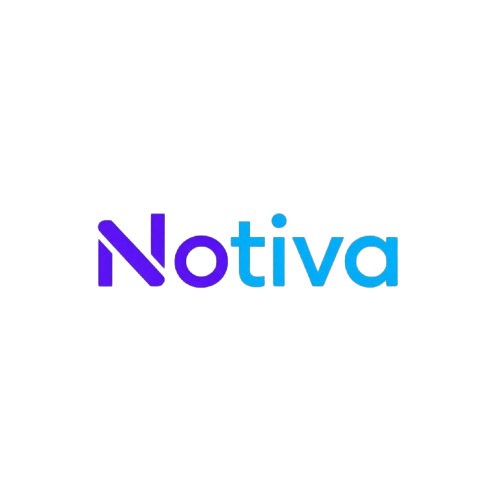

<div align="center">
  
  <h1>Notiva</h1>
  <p><strong>The Intelligent Neural Engine for Your Personal Knowledge Base</strong></p>

  [](https://opensource.org/licenses/MIT)
  [](https://notiva.app)
  [](https://notiva.app)
</div>

---

## 💎 The Vision (Marketing)

Notiva isn't just a note-taking app; it's a **second brain**. In an era of information overload, Notiva provides a sanctuary for your thoughts and a powerful engine to retrieve, summarize, and connect them. 

- **Contextual Intelligence**: Our RAG (Retrieval-Augmented Generation) system ensures AI responses are grounded *only* in your data.
- **Seamless Ingestion**: From voice dictation and PDF uploads to web scraping, knowledge flows effortlessly into Notiva.
- **Multilingual & Accessible**: Real-time translation and high-fidelity text-to-speech bridge the gap between ideas and understanding.
- **Visual Connectivity**: Explore your knowledge through interactive topological graphs, revealing semantic clusters you didn't know existed.

## 🛠️ The Architecture (Tech)

Notiva is built on a high-performance, decoupled architecture designed for scale and reliability.

### Core Stack
- **Frontend**: Next.js 14 (App Router) with TypeScript, leveraging Framer Motion for premium interactions and a custom Vanilla CSS design system.
- **Backend**: Python-based FastAPI services, optimized for asynchronous execution and low-latency token streaming.
- **Persistence**: Hybrid storage using PostgreSQL via SQLAlchemy for relational data and ChromaDB for high-dimensional vector embeddings.
- **LLM Orchestration**: A smart routing layer that prioritizes Google Gemini 1.5 Pro/Flash with automated transparent fallback to Mistral AI to ensure 100% availability.

### Engineering Highlights
- **Real-time Pipeline**: Integrated BeautifulSoup4 and PyPDF2 for instant document parsing.
- **Optimistic UI**: State-management patterns that ensure zero-latency feedback during complex AI operations.
- **Self-Healing Vector Store**: Automated background synchronization between SQL and Vector layers to maintain semantic integrity.

## 🚀 Engineering Excellence (Recruiting)

We solve deep engineering challenges at the intersection of productivity software and GenAI.

- **Distributed RAG**: Implementing complex retrieval strategies (Top-K, Semantic RAG) that effectively bridge LLMs with private data.
- **Full-Stack Mastery**: Working across the entire stack—from fine-tuning Tailwind/CSS variables for a premium aesthetic to architecting scalable Python microservices.
- **Performance First**: Optimizing vector search indexing and frontend rendering to ensure a desktop-class experience in the browser.

---

## 🏁 Quick Start

### 1. Backend
```bash
cd Backend
pip install -r requirements.txt
# Configure your .env with GEMINI_API_KEY and DATABASE_URL
uvicorn app.main:app --reload
```

### 2. Frontend
```bash
cd my-app
npm install
npm run dev
```

---

<div align="center">
  <p>Built with ❤️ by the Notiva Team</p>
  <p><i>Empowering productivity through intelligent design.</i></p>
</div>
