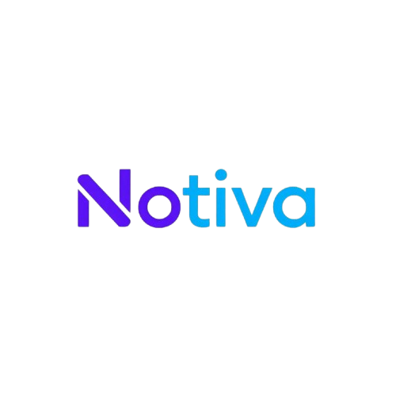

<div align="center">
  

  <p><strong>The Intelligent Neural Engine for Your Personal Knowledge Base</strong></p>

[](https://notiva.app)
[](https://notiva.app)

</div>

---

## 💎 The Vision

Notiva isn't just a note-taking app; it's a **second brain**. In an era of information overload, Notiva provides a sanctuary for your thoughts and a powerful engine to retrieve, summarize, and connect them.

* **Contextual Intelligence**: Our RAG (Retrieval-Augmented Generation) system ensures AI responses are grounded *only* in your data.
* **Seamless Ingestion**: From voice dictation and PDF uploads to web scraping, knowledge flows effortlessly into Notiva.
* **Multilingual & Accessible**: Real-time translation and high-fidelity text-to-speech bridge the gap between ideas and understanding.
* **Visual Connectivity**: Explore your knowledge through interactive topological graphs, revealing semantic clusters you didn't know existed.

## 🛠️ The Architecture (Tech)

Notiva is built on a high-performance, decoupled architecture designed for scalability and reliability.

### Core Stack

* **Frontend**: React.js with JavaScript, using modern component-based architecture, Framer Motion for premium interactions, and a custom Vanilla CSS design system.
* **Backend**: Python-based FastAPI services, optimized for asynchronous execution and low-latency token streaming.
* **Persistence**: Hybrid storage using PostgreSQL via SQLAlchemy for relational data and ChromaDB for high-dimensional vector embeddings.
* **LLM Orchestration**: A smart routing layer that prioritizes Google Gemini with automated fallback to Mistral AI for reliable AI-powered responses.

### Engineering Highlights

* **Real-time Pipeline**: Integrated BeautifulSoup4 and PyPDF2 for document parsing and knowledge ingestion.
* **Optimistic UI**: State-management patterns that provide immediate feedback during complex AI operations.
* **Self-Healing Vector Store**: Automated background synchronization between SQL and Vector layers to maintain semantic integrity.

## 🚀 Engineering Excellence (Recruiting)

We solve engineering challenges at the intersection of productivity software and Generative AI.

* **RAG Architecture**: Implementing retrieval strategies such as Top-K and semantic search to effectively bridge LLMs with private user data.
* **Full-Stack Development**: Working across the entire stack—from building responsive React.js interfaces to architecting scalable Python FastAPI services.
* **Performance First**: Optimizing vector search, API responses, and frontend rendering to provide a fast and responsive experience.

---

## 🏁 Quick Start

### 1. Backend

```bash
cd Backend
pip install -r requirements.txt
# Configure your .env with GEMINI_API_KEY and DATABASE_URL
uvicorn app.main:app --reload
```

### 2. Frontend

```bash
cd my-app
npm install
npm start
```

---

<div align="center">
  <p>Built with ❤️ by <b>Vamshi Krishna Sai</b></p>
  <p><i>Empowering productivity through intelligent design.</i></p>
</div>
